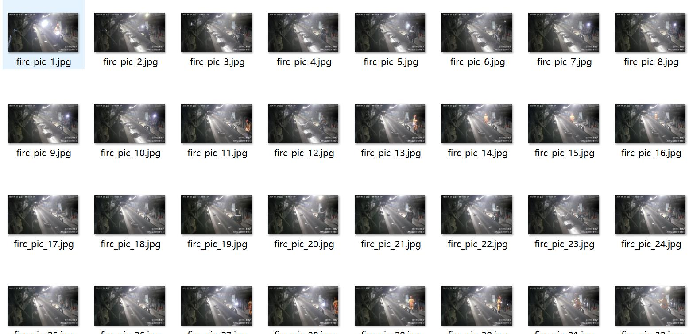
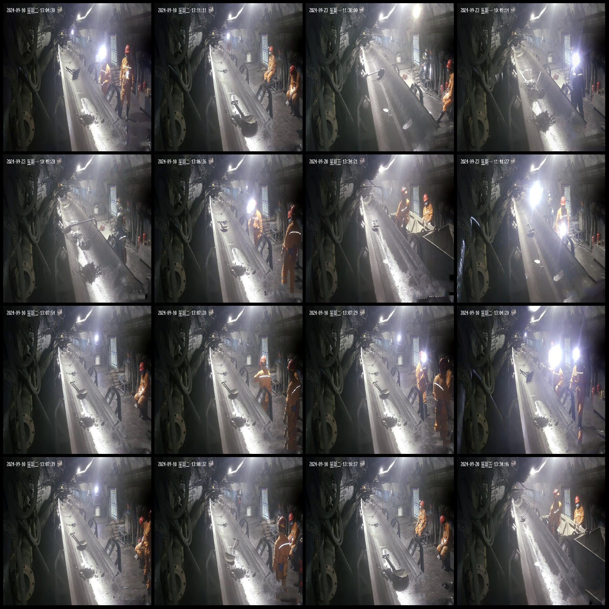
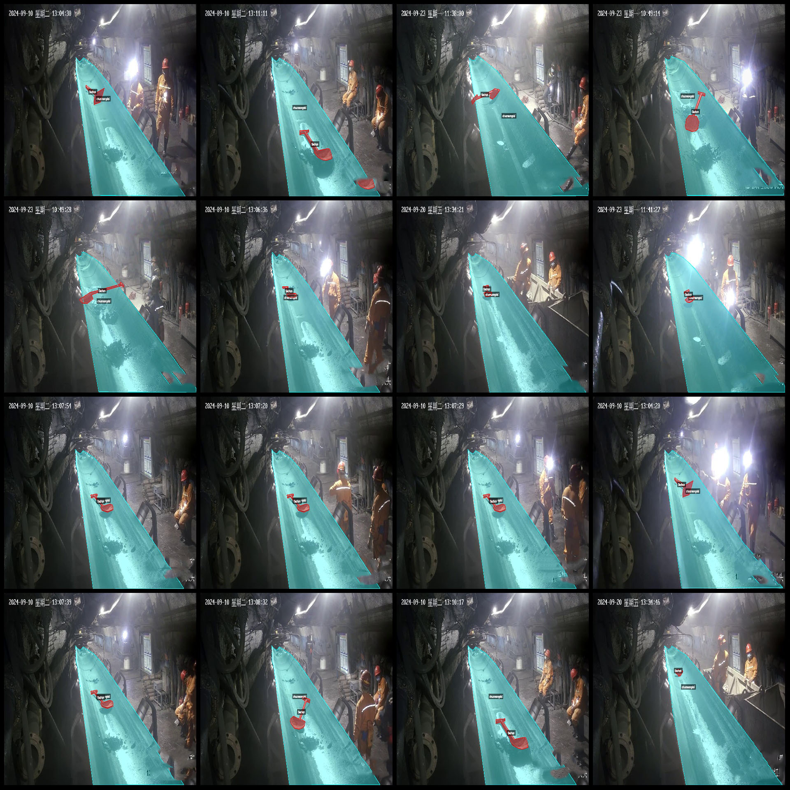
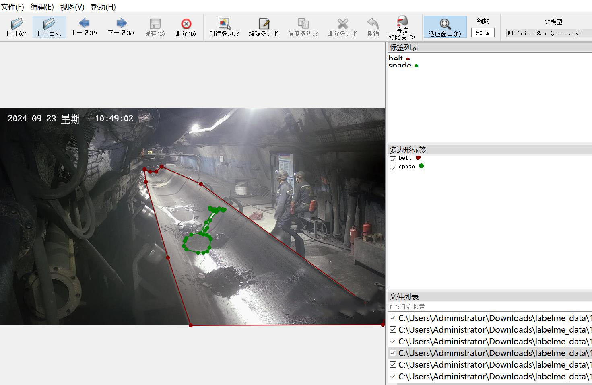

# Intelligent Mine Transfer Belt Iron Spoon Identification and Segmentation Dataset - Labelme Format with 211 Images in 2 Categories

Dataset format: Labelme format (excluding mask files, only containing jpg images and corresponding json files)
Number of image files: 211
Number of annotations: 211
Number of annotation categories: 2
Annotation category names: ["chuansongdai", "tiechan"]
Each category has an annotation box count:
- Chuansongdai (transfer belt) count = 211
- Tiechan (iron scoop) count = 206
Total boxes: 417
Annotation tool used: labelme=5.5.0
Image resolution: 1920x1080
Annotation rules: Polygons are drawn around the category
Important note: The dataset can be edited using labelme. JSON datasets need to be converted into either mask, Yolo, or Coco format for semantic segmentation or instance segmentation.
Special declaration: This dataset does not guarantee the accuracy of the trained model or weight files.
Image preview:
Annotation example:
Randomly selected 16 images:
Annotation drawing result:
Labelme editing image example:

## Picture

Here is a pay link on Stripe ( https://buy.stripe.com/3cs8yP7sY87d0vu9AB ). Please contact me lonlonago@foxmail.com after funding $89, and I will send you a complete data files , thank you!

